# ManagerService Frontend

## Giới thiệu

Đây là hệ thống quản lý kho, sản phẩm, người dùng, nhiệm vụ, nhà cung cấp... được xây dựng với React, Redux Toolkit, Zustand, Vite, TailwindCSS và HeroUI. Dự án cung cấp giao diện quản trị hiện đại, dễ mở rộng, tích hợp API backend linh hoạt.

## Cấu trúc thư mục chính

- `src/pages/` — Các trang chính (Dashboard, Product, User, Stack, TaskType, Tasks, Unit, Category, Supplier...)
- `src/components/` — Các UI component tái sử dụng (Table, Modal, Form, Button, Breadcrumbs...)
- `src/Store/` — Redux store, slice quản lý state cho từng module
- `src/zustand/` — Store Zustand cho một số state cục bộ
- `src/Api/` — Hàm fetch API, tích hợp backend
- `src/Router/` — Định tuyến ứng dụng
- `src/layouts/` — Layout tổng thể, layout admin

## Chức năng chính

- **Đăng nhập**: Xác thực người dùng, chuyển hướng dashboard.
- **Dashboard**: Thống kê tổng quan, biểu đồ tiến độ, filter nhanh.
- **Quản lý sản phẩm**: Xem, thêm mới, chỉnh sửa sản phẩm, upload ảnh.
- **Quản lý người dùng**: Xem danh sách, thêm mới, chỉnh sửa nhân viên.
- **Quản lý kho/vị trí (Stack)**: Xem, thêm, chỉnh sửa vị trí lưu trữ.
- **Quản lý loại nhiệm vụ (TaskType)**: Xem, thêm, chỉnh sửa loại nhiệm vụ.
- **Quản lý nhiệm vụ (Tasks)**: Xem, thêm, chỉnh sửa nhiệm vụ theo loại.
- **Quản lý nhóm đơn vị (Group Unit)**: Xem, thêm, chỉnh sửa nhóm đơn vị.
- **Quản lý loại đơn vị (Unit Type)**: Xem, chỉnh sửa loại đơn vị, tỉ lệ quy đổi.
- **Quản lý danh mục (Category)**: Xem, thêm, chỉnh sửa danh mục sản phẩm.
- **Quản lý nhà cung cấp (Supplier)**: Xem, thêm, chỉnh sửa nhà cung cấp, upload ảnh.
- **404 Page**: Trang báo lỗi khi truy cập route không tồn tại.

## Flow tổng quan hệ thống

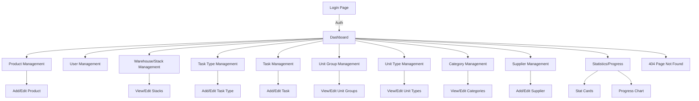

## Kiến trúc & luồng dữ liệu

- **State Management**: Sử dụng Redux Toolkit cho state toàn cục (sản phẩm, user, stack, task, v.v.), Zustand cho một số state cục bộ.
- **API**: Hàm fetchApi chuẩn hóa gọi API, xử lý lỗi, toast thông báo.
- **Routing**: Sử dụng React Router, phân quyền qua loader CheckAuth.
- **UI**: TailwindCSS, HeroUI, component hóa mạnh mẽ, hỗ trợ dark mode.

## Hướng dẫn cài đặt & chạy

```bash
npm install
npm run dev
```

## Đóng góp

- Fork, tạo branch mới, PR với mô tả rõ ràng.

## License

MIT

## Hướng dẫn phát triển

### 1. Cài đặt môi trường

- Node.js >= 16
- npm >= 8
- Clone repo về máy: `git clone <repo-url>`
- Cài đặt: `npm install`

### 2. Chạy dev

```bash
npm run dev
```

### 3. Build production

```bash
npm run build
npm run preview
```

### 4. Quy ước code

- Sử dụng TypeScript, React function component.
- Tên file PascalCase, hook: useXxx, slice: XxxSlice.tsx.
- State toàn cục: Redux Toolkit, state cục bộ: Zustand hoặc useState.
- UI: TailwindCSS, HeroUI, component hóa tối đa.
- Đặt API endpoint trong `src/Constants/UrlApi.tsx`.

### 5. Kiểm thử

- Viết test cho component quan trọng (ưu tiên Jest, React Testing Library).
- Chạy test: `npm test` (nếu cấu hình test).

### 6. Đóng góp

- Fork repo, tạo branch mới từ `main`.
- Commit message rõ ràng, mô tả ý nghĩa.
- Tạo Pull Request, mô tả thay đổi, gắn reviewer.
- Được review, passed CI mới merge.

### 7. Build & Deploy

- Build: `npm run build` → tạo thư mục `dist/`.
- Deploy lên Vercel, Netlify, hoặc server bất kỳ hỗ trợ static file.
- Có thể cấu hình thêm file `vercel.json` nếu deploy Vercel.

## Chi tiết Store, Slice, Hook, Component quan trọng

### 1. Store & Slice (Redux Toolkit)

#### ProductSlice (`src/Store/ProductSlice.tsx`)

- Quản lý state sản phẩm: danh sách, chi tiết, thêm/sửa/xóa sản phẩm.
- Action chính: `MiddleAddProduct`, `MiddleGetAllProduct`, `MiddleUpdateProduct`, ...
- State: `products`, `loading`, `error`.

#### UserSlice (`src/Store/UserSlice.tsx`)

- Quản lý state người dùng: danh sách, chi tiết, thêm/sửa/xóa user.
- Action chính: `MiddleGetAllUser`, `MiddleAddUser`, ...
- State: `users`, `loading`, `error`.

#### StackSlice (`src/Store/StackSlice.tsx`)

- Quản lý vị trí/kho: danh sách stack, thêm/sửa/xóa stack.
- Action: `MiddleGetAllStack`, `MiddleAddStack`, ...
- State: `stacks`, `loading`, `error`.

#### TaskTypeSlice & TaskSlice

- Quản lý loại nhiệm vụ và nhiệm vụ cụ thể.
- Action: `MiddleGetAllTaskType`, `MiddleAddTaskType`, `MiddleGetAllTask`, `MiddleAddTask`, ...
- State: `taskTypes`, `tasks`, `loading`, `error`.

#### SupplierSlice, CategorySlice, GroupUnit, UnitSlice, WarehouseSlice

- Tương tự: quản lý danh sách, thêm/sửa/xóa, state loading/error.

#### Store tổng (`src/Store/Store.tsx`)

- Kết hợp tất cả slice vào rootReducer.
- Cung cấp store cho toàn bộ app qua Provider.

### 2. Zustand Store (`src/zustand/`)

- Dùng cho state cục bộ, ví dụ: Product, Supplier, File upload tạm thời.
- Hook: `useProductStore`, `useSupplierStore`, ...

### 3. Hook quan trọng (`src/Hooks/`)

- `use-click-outside.tsx`: Xử lý sự kiện click ra ngoài một element (đóng modal, dropdown...)

### 4. Component quan trọng

- `TableUI`: Hiển thị bảng dữ liệu, hỗ trợ phân trang, chọn cột, action.
- `ModalUI`: Hiển thị modal xác nhận, form nhập liệu.
- `ButtonUI`: Nút bấm chuẩn hóa style.
- `BreadcrumbsUI`: Hiển thị breadcrumb điều hướng.
- `Form/*`: Các form nhập liệu cho Product, User, Supplier, Task, ...
- `StatCardAdmin`, `StatFilterAdmin`, `ProgressStack`: Hiển thị thống kê, filter, tiến độ trên dashboard.

## Flow & Chi tiết module: Product

### Sơ đồ flow chức năng Product

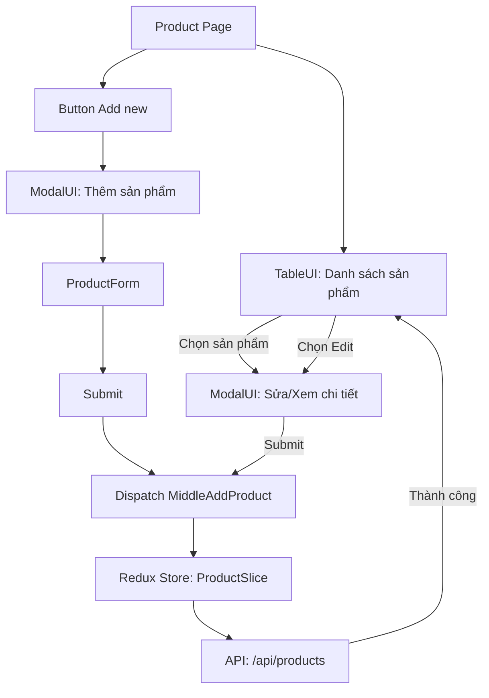

### Luồng dữ liệu & component liên quan

- **ProductPage**: Trang chính quản lý sản phẩm, hiển thị danh sách, nút thêm mới.
- **TableUI**: Hiển thị danh sách sản phẩm, cho phép chọn để sửa/xem chi tiết.
- **ModalUI**: Hiển thị form thêm/sửa sản phẩm.
- **ProductForm**: Form nhập liệu sản phẩm (tên, mô tả, giá, ảnh, ...).
- **Redux Store (ProductSlice)**: Quản lý state sản phẩm, dispatch action thêm/sửa/xóa.
- **API**: Giao tiếp với backend qua endpoint `/api/products`.

### Sequence Diagram

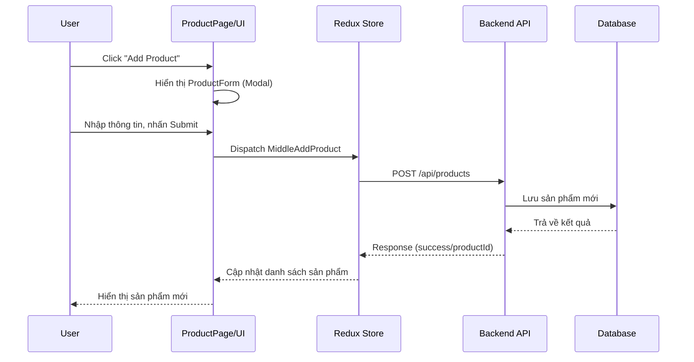

## API Product

### 1. Lấy danh sách sản phẩm

- **Endpoint:** `GET /api/products`
- **Request:**
  - Query: `?page=1&pageSize=10`
- **Response mẫu:**

```json
{
  "data": [
    { "productId": "1", "productName": "Sản phẩm A", "price": 100, ... },
    { "productId": "2", "productName": "Sản phẩm B", "price": 200, ... }
  ],
  "total": 50
}
```

### 2. Thêm mới sản phẩm

- **Endpoint:** `POST /api/products`
- **Request body:**

```json
{
  "productName": "Sản phẩm mới",
  "description": "Mô tả",
  "price": 100,
  "sku": "SP001",
  "category": "catId",
  "supplier": "supId",
  "unit": "unitId",
  "urlImageProduct": "url",
  "warehouses": "warehouseId"
}
```

- **Response:**

```json
{
  "success": true,
  "productId": "123"
}
```

### 3. Sửa sản phẩm

- **Endpoint:** `PUT /api/products/{id}`
- **Request body:** (giống thêm mới)
- **Response:**

```json
{
  "success": true
}
```

### 4. Xóa sản phẩm

- **Endpoint:** `DELETE /api/products/{id}`
- **Response:**

```json
{
  "success": true
}
```

**Ý nghĩa các trường:**

- `productId`: Mã sản phẩm
- `productName`: Tên sản phẩm
- `price`: Giá bán
- `sku`: Mã SKU
- `category`, `supplier`, `unit`, `warehouses`: Liên kết đến các entity khác
- `urlImageProduct`: Ảnh sản phẩm

## API User

### 1. Lấy danh sách người dùng

- **Endpoint:** `GET /api/users`
- **Request:**
  - Query: `?page=1&pageSize=10`
- **Response mẫu:**

```json
{
  "data": [
    { "userId": "1", "userName": "admin", "fullName": "Nguyễn Văn A", "email": "a@email.com", ... },
    { "userId": "2", "userName": "user1", "fullName": "Trần Thị B", ... }
  ],
  "total": 20
}
```

### 2. Thêm mới người dùng

- **Endpoint:** `POST /api/users`
- **Request body:**

```json
{
  "userName": "user2",
  "fullName": "Nguyễn Văn C",
  "email": "c@email.com",
  "phoneNumber": "0123456789",
  "warehouses": "warehouseId",
  "urlImage": "url"
}
```

- **Response:**

```json
{
  "success": true,
  "userId": "3"
}
```

### 3. Sửa người dùng

- **Endpoint:** `PUT /api/users/{id}`
- **Request body:** (giống thêm mới)
- **Response:**

```json
{
  "success": true
}
```

### 4. Xóa người dùng

- **Endpoint:** `DELETE /api/users/{id}`
- **Response:**

```json
{
  "success": true
}
```

**Ý nghĩa các trường:**

- `userId`: Mã người dùng
- `userName`: Tên đăng nhập
- `fullName`: Họ tên
- `email`: Email
- `phoneNumber`: Số điện thoại
- `warehouses`: Kho làm việc
- `urlImage`: Ảnh đại diện

## API Task/TaskType

### 1. Lấy danh sách loại nhiệm vụ

- **Endpoint:** `GET /api/task-types`
- **Request:**
  - Query: `?page=1&pageSize=10`
- **Response mẫu:**

```json
{
  "data": [
    { "taskTypeId": "1", "taskName": "Kiểm kê kho", "description": "...", ... },
    { "taskTypeId": "2", "taskName": "Xuất hàng", ... }
  ],
  "total": 5
}
```

### 2. Thêm mới loại nhiệm vụ

- **Endpoint:** `POST /api/task-types`
- **Request body:**

```json
{
  "taskName": "Nhập hàng",
  "description": "Nhập hàng vào kho",
  "warehouses": "warehouseId"
}
```

- **Response:**

```json
{
  "success": true,
  "taskTypeId": "3"
}
```

### 3. Lấy danh sách nhiệm vụ theo loại

- **Endpoint:** `GET /api/tasks?taskTypeId=1&page=1&pageSize=10`
- **Response mẫu:**

```json
{
  "data": [
    { "taskId": "1", "description": "Kiểm kê khu A", "statusTask": "pending", ... },
    { "taskId": "2", "description": "Kiểm kê khu B", ... }
  ],
  "total": 10
}
```

### 4. Thêm mới nhiệm vụ

- **Endpoint:** `POST /api/tasks`
- **Request body:**

```json
{
  "description": "Kiểm kê khu C",
  "warehouses": "warehouseId",
  "taskType": "taskTypeId",
  "level": "high",
  "completeAt": "2024-06-01"
}
```

- **Response:**

```json
{
  "success": true,
  "taskId": "11"
}
```

### 5. Sửa nhiệm vụ

- **Endpoint:** `PUT /api/tasks/{id}`
- **Request body:** (giống thêm mới)
- **Response:**

```json
{
  "success": true
}
```

### 6. Xóa nhiệm vụ

- **Endpoint:** `DELETE /api/tasks/{id}`
- **Response:**

```json
{
  "success": true
}
```

**Ý nghĩa các trường:**

- `taskTypeId`: Mã loại nhiệm vụ
- `taskName`: Tên loại nhiệm vụ
- `taskId`: Mã nhiệm vụ
- `description`: Mô tả nhiệm vụ
- `statusTask`: Trạng thái
- `level`: Mức độ ưu tiên
- `completeAt`: Hạn hoàn thành
- `warehouses`: Kho liên quan

### Sequence Diagram

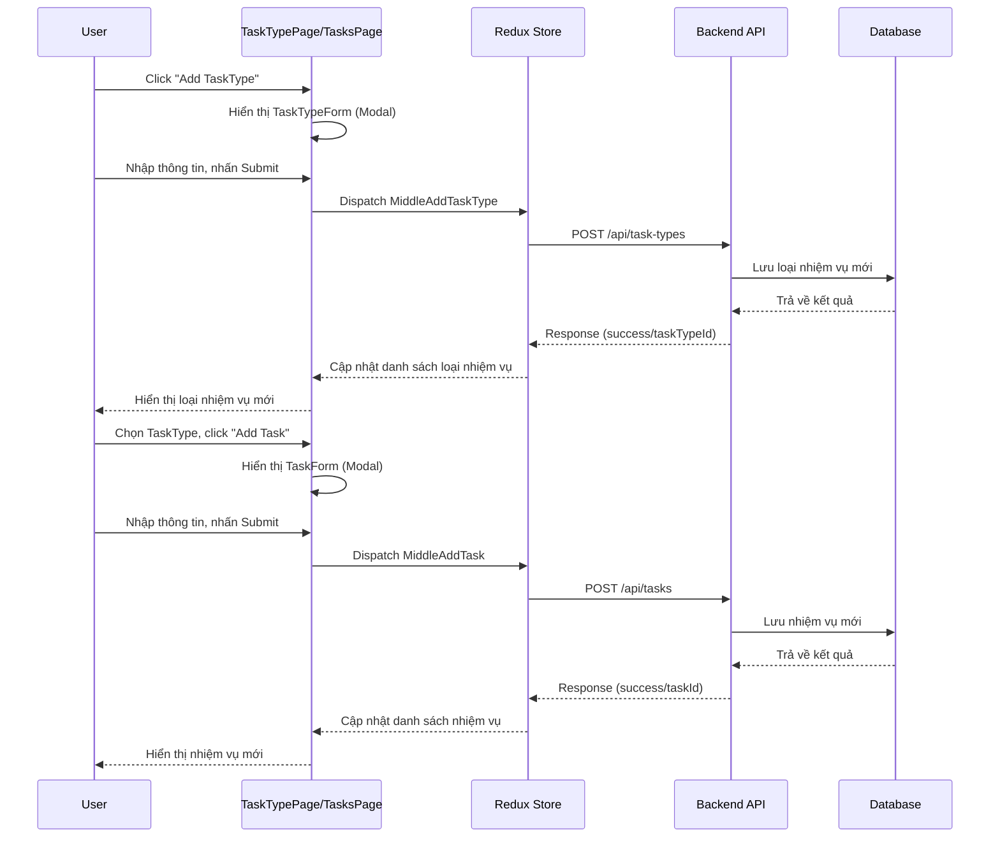

## API Stack/Warehouse

### 1. Lấy danh sách vị trí/kho

- **Endpoint:** `GET /api/stacks`
- **Request:**
  - Query: `?page=1&pageSize=10`
- **Response mẫu:**

```json
{
  "data": [
    { "stackId": "1", "stackName": "Kệ A", "description": "...", ... },
    { "stackId": "2", "stackName": "Kệ B", ... }
  ],
  "total": 12
}
```

### 2. Thêm mới vị trí/kho

- **Endpoint:** `POST /api/stacks`
- **Request body:**

```json
{
  "stackName": "Kệ mới",
  "description": "Kệ tầng 2",
  "warehouse": "warehouseId"
}
```

- **Response:**

```json
{
  "success": true,
  "stackId": "5"
}
```

### 3. Sửa vị trí/kho

- **Endpoint:** `PUT /api/stacks/{id}`
- **Request body:** (giống thêm mới)
- **Response:**

```json
{
  "success": true
}
```

### 4. Xóa vị trí/kho

- **Endpoint:** `DELETE /api/stacks/{id}`
- **Response:**

```json
{
  "success": true
}
```

**Ý nghĩa các trường:**

- `stackId`: Mã vị trí/kho
- `stackName`: Tên vị trí/kho
- `description`: Mô tả
- `warehouse`: Kho liên kết

### Sequence Diagram

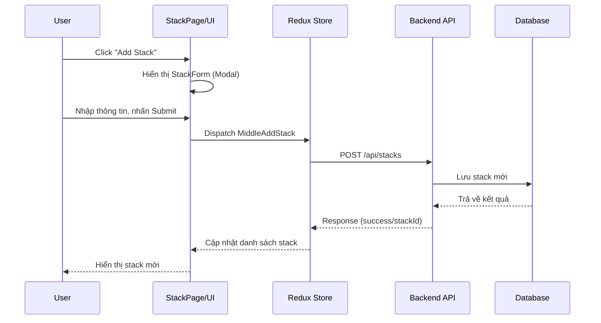

## API Supplier

### 1. Lấy danh sách nhà cung cấp

- **Endpoint:** `GET /api/suppliers`
- **Request:**
  - Query: `?page=1&pageSize=10`
- **Response mẫu:**

```json
{
  "data": [
    { "supplierId": "1", "supplierName": "Công ty A", "urlSupplier": "...", ... },
    { "supplierId": "2", "supplierName": "Công ty B", ... }
  ],
  "total": 8
}
```

### 2. Thêm mới nhà cung cấp

- **Endpoint:** `POST /api/suppliers`
- **Request body:**

```json
{
  "supplierName": "Công ty mới",
  "urlSupplier": "url ảnh",
  "description": "Mô tả",
  "warehouses": "warehouseId"
}
```

- **Response:**

```json
{
  "success": true,
  "supplierId": "9"
}
```

### 3. Sửa nhà cung cấp

- **Endpoint:** `PUT /api/suppliers/{id}`
- **Request body:** (giống thêm mới)
- **Response:**

```json
{
  "success": true
}
```

### 4. Xóa nhà cung cấp

- **Endpoint:** `DELETE /api/suppliers/{id}`
- **Response:**

```json
{
  "success": true
}
```

**Ý nghĩa các trường:**

- `supplierId`: Mã nhà cung cấp
- `supplierName`: Tên nhà cung cấp
- `urlSupplier`: Ảnh nhà cung cấp
- `description`: Mô tả
- `warehouses`: Kho liên kết

### Sequence Diagram

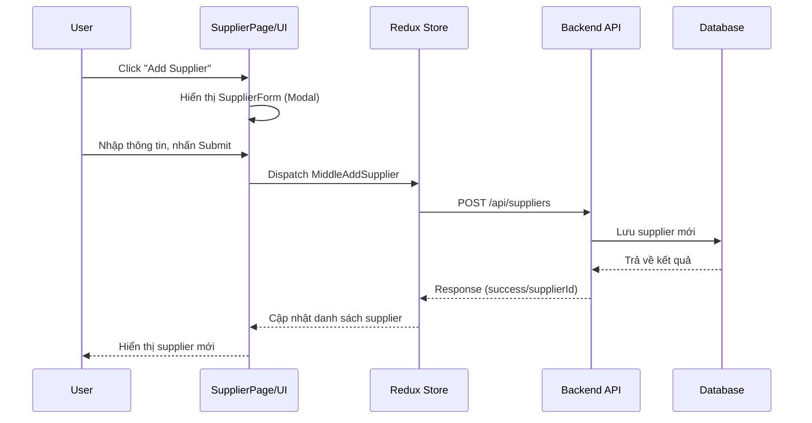

## API Category

### 1. Lấy danh sách danh mục

- **Endpoint:** `GET /api/categories`
- **Request:**
  - Query: `?page=1&pageSize=10`
- **Response mẫu:**

```json
{
  "data": [
    { "categoryId": "1", "categoryName": "Danh mục A", "description": "...", ... },
    { "categoryId": "2", "categoryName": "Danh mục B", ... }
  ],
  "total": 6
}
```

### 2. Thêm mới danh mục

- **Endpoint:** `POST /api/categories`
- **Request body:**

```json
{
  "categoryName": "Danh mục mới",
  "description": "Mô tả",
  "warehouses": "warehouseId"
}
```

- **Response:**

```json
{
  "success": true,
  "categoryId": "7"
}
```

### 3. Sửa danh mục

- **Endpoint:** `PUT /api/categories/{id}`
- **Request body:** (giống thêm mới)
- **Response:**

```json
{
  "success": true
}
```

### 4. Xóa danh mục

- **Endpoint:** `DELETE /api/categories/{id}`
- **Response:**

```json
{
  "success": true
}
```

**Ý nghĩa các trường:**

- `categoryId`: Mã danh mục
- `categoryName`: Tên danh mục
- `description`: Mô tả
- `warehouses`: Kho liên kết

### Sequence Diagram

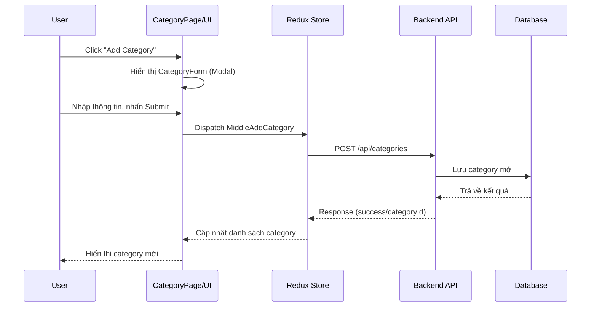

## API Group Unit

### 1. Lấy danh sách nhóm đơn vị

- **Endpoint:** `GET /api/group-units`
- **Request:**
  - Query: `?page=1&pageSize=10`
- **Response mẫu:**

```json
{
  "data": [
    { "groupUnitId": "1", "groupName": "Nhóm A", "unitType": "Weight", ... },
    { "groupUnitId": "2", "groupName": "Nhóm B", ... }
  ],
  "total": 4
}
```

### 2. Thêm mới nhóm đơn vị

- **Endpoint:** `POST /api/group-units`
- **Request body:**

```json
{
  "groupName": "Nhóm mới",
  "unitType": "Weight",
  "baseUnitRatio": 1,
  "description": "Mô tả",
  "warehouses": "warehouseId"
}
```

- **Response:**

```json
{
  "success": true,
  "groupUnitId": "5"
}
```

### 3. Sửa nhóm đơn vị

- **Endpoint:** `PUT /api/group-units/{id}`
- **Request body:** (giống thêm mới)
- **Response:**

```json
{
  "success": true
}
```

### 4. Xóa nhóm đơn vị

- **Endpoint:** `DELETE /api/group-units/{id}`
- **Response:**

```json
{
  "success": true
}
```

**Ý nghĩa các trường:**

- `groupUnitId`: Mã nhóm đơn vị
- `groupName`: Tên nhóm
- `unitType`: Loại đơn vị (Weight, Volume, ...)
- `baseUnitRatio`: Tỉ lệ quy đổi
- `description`: Mô tả
- `warehouses`: Kho liên kết

### Sequence Diagram

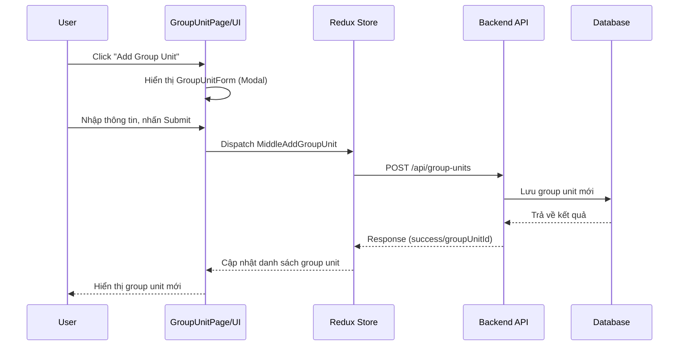

## Flow & Chi tiết module: Unit Type

### Sơ đồ flow chức năng Unit Type

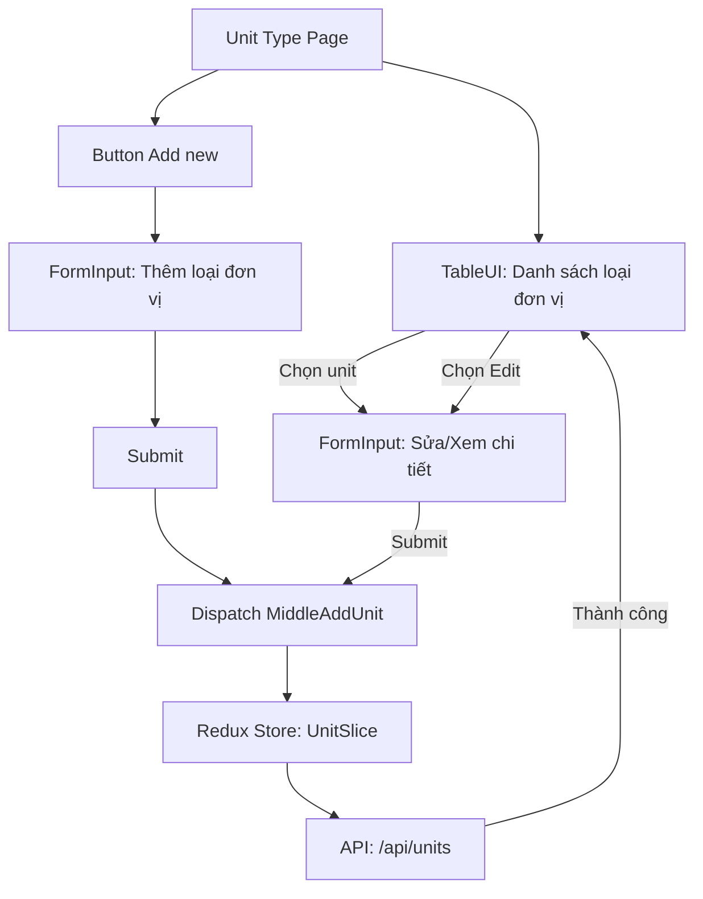

### Luồng dữ liệu & component liên quan

- **UnitTypePage**: Trang quản lý loại đơn vị, hiển thị danh sách, thêm mới.
- **TableUI**: Hiển thị danh sách loại đơn vị.
- **FormInput**: Form nhập/sửa thông tin loại đơn vị.
- **Redux Store (UnitSlice)**: Quản lý state loại đơn vị, dispatch action thêm/sửa/xóa.
- **API**: Giao tiếp với backend qua endpoint `/api/units`.

### Sequence Diagram

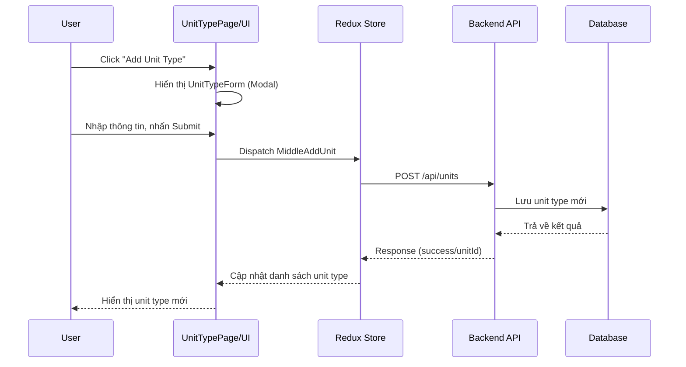

## API Unit Type

### 1. Lấy danh sách loại đơn vị

- **Endpoint:** `GET /api/units`
- **Request:**
  - Query: `?page=1&pageSize=10`
- **Response mẫu:**

```json
{
  "data": [
    { "unitId": "1", "unitName": "Kg", "groupUnit": "Nhóm A", ... },
    { "unitId": "2", "unitName": "Lít", ... }
  ],
  "total": 10
}
```

### 2. Thêm mới loại đơn vị

- **Endpoint:** `POST /api/units`
- **Request body:**

```json
{
  "unitName": "Tấn",
  "groupUnit": "groupUnitId",
  "description": "Mô tả",
  "warehouses": "warehouseId"
}
```

- **Response:**

```json
{
  "success": true,
  "unitId": "11"
}
```

### 3. Sửa loại đơn vị

- **Endpoint:** `PUT /api/units/{id}`
- **Request body:** (giống thêm mới)
- **Response:**

```json
{
  "success": true
}
```

### 4. Xóa loại đơn vị

- **Endpoint:** `DELETE /api/units/{id}`
- **Response:**

```json
{
  "success": true
}
```

**Ý nghĩa các trường:**

- `unitId`: Mã loại đơn vị
- `unitName`: Tên loại đơn vị
- `groupUnit`: Nhóm đơn vị liên kết
- `description`: Mô tả
- `warehouses`: Kho liên kết

## Flow & Chi tiết module: Warehouse (Dashboard)

### Sơ đồ flow chức năng Warehouse/Dashboard

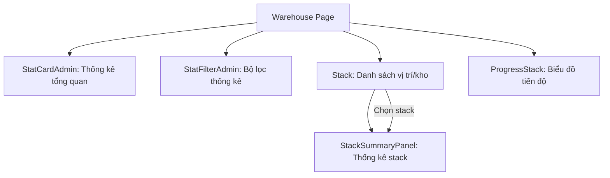

### Luồng dữ liệu & component liên quan

- **WarehousePage (Dashboard)**: Trang tổng quan, hiển thị thống kê, filter, danh sách vị trí/kho, tiến độ.
- **StatCardAdmin**: Hiển thị các chỉ số tổng quan (đơn hàng, doanh thu, ...).
- **StatFilterAdmin**: Bộ lọc thống kê.
- **Stack**: Hiển thị danh sách vị trí/kho.
- **StackSummaryPanel**: Thống kê chi tiết cho stack được chọn.
- **ProgressStack**: Biểu đồ tiến độ sử dụng kho.
